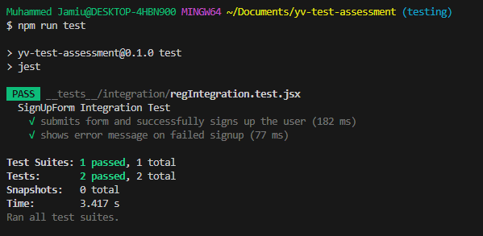

# Invoicing App


## Overview
This is a simple invoicing application designed based on the provided Figma design. It includes user authentication (using Firebase), a mock backend, real-time data flow, unit and integration tests for key components, and responsive UI across devices.

## Features
- User Authentication: 
    -   Seamless signup and login process using Firebase authentication.
    -   Upon successful signup, users are automatically logged into the dashboard, enhancing user experience. After logging out, users can conveniently log back in via the login page.

- Mock Backend: 
    -   Utilizes a JSON server to simulate API responses, facilitating development and testing without requiring a live backend.

- Real-time Data Flow: 
    -   Leverages WebSockets to provide real-time updates, ensuring that users receive instant notifications on the Recent Activities page within the invoice dashboard. This feature enhances collaboration and keeps users informed about important changes.

- Responsive Design: 
    -   Fully responsive layout optimized for a wide range of devices, ensuring a consistent and user-friendly experience whether on mobile, tablet, or desktop.

- Testing: Unit and Integration testing are done for 5 components such as 
    - Login,
    - SignUp,
    - Global button,
    - Invoice action card.
    
- Error Handling: 
    -   Proactively addresses potential issues, enhancing user experience:
    -   Invalid URLs: A custom 404 error page is displayed when users navigate to non-existent routes, guiding them back to the main content.

    -   Network Issues: Handled gracefully via an Axios instance, providing feedback and recovery options for users.
    -   General Error Handling: Displays informative error messages for various potential errors, improving overall robustness.

- Loading State Feedback: 
    -   A loading spinner appears when users log in to the dashboard, indicating data retrieval in progress, which keeps users informed and engaged while waiting for content to load.

- Invoice Creation: 
    -   Users can create new invoices that are seamlessly integrated into existing mock data, allowing for real-time updates and testing.
- PDF Download: 
    -   Users can easily download invoices in PDF format, facilitating offline access and sharing of documents.


## Tech Stack
- Frontend: Next.js for building a modern React-based application.
- Styling: Tailwind CSS for utility-first CSS styling.
- Authentication: Firebase for managing user authentication.
- Real-Time: WebSocket for real-time updates.
- Testing: Jest and React Testing Library for unit and integration tests.
- Mock API: json-server for simulating a backend.

## Getting Started
First, run the development server:

```bash
Instructions:

- Clone the repository: 
            git clone https://github.com/muideenjamiu01/yv-test-assessment.git
- Install dependencies:
                 npm install
- Run the app:
             npm run dev
- Backend API: 
        Run mock server: npx json-server --watch db.json --port 4000

- Open the app at: 
                http://localhost:3000

npm run dev
# or
yarn dev
# or
pnpm dev
# or
bun dev
```
## To run all servers at a go
npm run start:all


## To Run the mock backend
 - npx json-server --watch db.json --port 4000

## To Start web socket
 - npm run websocket-server


 ### Frontend Test Url
- https://yv-test-assessment-lk53.vercel.app/

### Frontend Live Url
- https://yv-test-assessment-lk53.vercel.app/

### Deployment
- This project is deployed on Vercel
- Live branch - main
- Test branch - development

# Images of Unit Test and Integration Test





